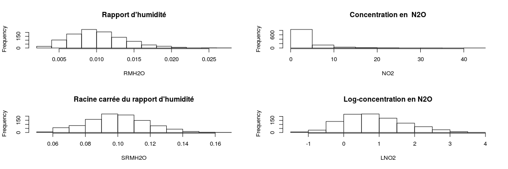

Classification par analyse discriminante
================
Antoine Chambaz
1/10/2017

Les notions
-----------

-   Algorithmes de classification par analyse discriminante

-   Courbes ROC

-   Ensembles d'apprentissage et de validation

-   Enrichissement de données

-   Interprétation algorithmique de l'entreprise de classification

-   Reproductibilité

-   Validation croisée pour l'évaluation honnête et la comparaison des performances

-   Visualisation d'un classifieur et de ses performances

Une introduction à la classification par analyse discriminante
--------------------------------------------------------------

``` r
set.seed(54321)
```

-   Mises à disposition par Météo France, ces données sont extraites du site [wikistat](https://github.com/wikistat). Nous souhaitons apprendre à prédire, à partir des données du jour, un dépassement du seuil de 150 μg par la concentration d'ozone le lendemain.

``` r
file <- file.path("http://www.math.univ-toulouse.fr/~besse/Wikistat/data", "depSeuil.dat")
ozone <- read.table(file, sep = ",", header = TRUE)

## JOUR: jour férié (1) ou pas (0)
## O3obs: concentration d'ozone effectivement observée le lendemain à 17h locales (correspond souvent au maximum de pollution observée)
## MOCAGE: prévision de cette pollution obtenue par un modèle déterministe de mécanique des fluides
## TEMPE: température prévue par Météo France pour le lendemain 17h
## RMH2O: rapport d'humidité
## NO2: concentration en dioxyde d'azote
## NO: concentration en monoxyde d'azote
## STATION: lieu de l'observation (Aix-en-Provence, Rambouillet, Munchhausen, Cadarache et Plan de Cuques)
## VentMOD: force du vent
## VentANG: orientation du vent

ozone[, "JOUR"] <- as.factor(ozone[, "JOUR"])
ozone[, "SRMH2O"] <- sqrt(ozone[, "RMH2O"])
ozone[, "LNO2"] <- log(ozone[, "NO2"])
ozone[, "LNO"] <- log(ozone[,"NO"])
ozone[, "DEPSEUIL"] <- as.factor(ozone[, "O3obs"] > 150)

head(ozone)
```

    ##   JOUR O3obs MOCAGE TEMPE   RMH2O   NO2    NO STATION VentMOD  VentANG
    ## 1    1    91   93.2  21.5 0.00847 1.602 0.424     Aix  9.5000 -0.64350
    ## 2    1   100  104.6  20.2 0.00881 2.121 0.531     Aix  8.0100 -0.04996
    ## 3    0    82  103.6  17.4 0.00951 1.657 0.467     Aix  9.3771 -0.12832
    ## 4    0    94   94.8  18.8 0.00855 2.350 0.701     Aix  9.4578 -0.34516
    ## 5    0   107   99.0  23.7 0.00731 1.653 0.452     Aix  7.8791 -0.41822
    ## 6    0   150  114.3  23.6 0.01182 5.316 1.343     Aix  6.3127  0.06341
    ##       SRMH2O      LNO2        LNO DEPSEUIL
    ## 1 0.09203260 0.4712528 -0.8580218    FALSE
    ## 2 0.09386160 0.7518877 -0.6329933    FALSE
    ## 3 0.09751923 0.5050087 -0.7614260    FALSE
    ## 4 0.09246621 0.8544153 -0.3552474    FALSE
    ## 5 0.08549854 0.5025918 -0.7940731    FALSE
    ## 6 0.10871982 1.6707211  0.2949059    FALSE

-   Pourquoi ces transformations?

``` r
par(mfrow=c(2, 2))
options(repr.plot.width = 6, repr.plot.height = 6)
hist(ozone[, "RMH2O"], xlab = "RMH2O", main = "Rapport d'humidité")
hist(ozone[, "NO2"],  xlab = "NO2",  main = "Concentration en  N2O")
hist(ozone[, "SRMH2O"], xlab = "SRMH2O", main = "Racine carrée du rapport d'humidité")
hist(ozone[, "LNO2"], xlab = "LNO2", main = "Log-concentration en N2O")
```



``` r
remove <- which(names(ozone) %in% c("RMH2O", "NO2", "NO", "O3obs"))
ozone <- ozone[, -remove]
depseuil.col <- grep("DEPSEUIL", names(ozone))

m <- nrow(ozone)
val <- sample(1:m, size = round(m/3), replace = FALSE, prob = rep(1/m, m)) 
ozone.train <- ozone[-val, ]
ozone.test <- ozone[val, ]
```

-   Classification par analyse discriminante *linéaire*.

``` r
suppressMessages(library(MASS))
trained.lda <- lda(DEPSEUIL ~ ., ozone.train)
test.lda <- predict(trained.lda, ozone.test)
lapply(test.lda, head)
```

    ## $class
    ## [1] TRUE  FALSE FALSE FALSE FALSE TRUE 
    ## Levels: FALSE TRUE
    ## 
    ## $posterior
    ##         FALSE        TRUE
    ## 448 0.1858318 0.814168200
    ## 521 0.5937696 0.406230405
    ## 185 0.6491051 0.350894947
    ## 287 0.9981986 0.001801388
    ## 227 0.7319853 0.268014734
    ## 904 0.4763099 0.523690057
    ## 
    ## $x
    ##            LD1
    ## 448  2.2749472
    ## 521  1.2093306
    ## 185  1.0741631
    ## 287 -2.1982075
    ## 227  0.8505773
    ## 904  1.4815757

``` r
perf.lda <- table(test.lda$class, ozone.test[, depseuil.col])
perf.lda
```

    ##        
    ##         FALSE TRUE
    ##   FALSE   289   23
    ##   TRUE      5   30

-   Classification par analyse discriminante *quadratique*.

``` r
trained.qda <- qda(DEPSEUIL ~ ., ozone.train)
test.qda <- predict(trained.qda, ozone.test)
lapply(test.qda, head)
```

    ## $class
    ## [1] TRUE  TRUE  FALSE FALSE FALSE TRUE 
    ## Levels: FALSE TRUE
    ## 
    ## $posterior
    ##          FALSE         TRUE
    ## 448 0.03836157 9.616384e-01
    ## 521 0.32874030 6.712597e-01
    ## 185 0.85467912 1.453209e-01
    ## 287 1.00000000 5.676183e-11
    ## 227 0.99773890 2.261101e-03
    ## 904 0.06226223 9.377378e-01

``` r
perf.qda <- table(test.qda$class, ozone.test[, depseuil.col])
perf.qda
```

    ##        
    ##         FALSE TRUE
    ##   FALSE   271   18
    ##   TRUE     23   35

-   Classification par analyse discriminante *régularisée*.

``` r
suppressMessages(library(rda))
remove <- which(names(ozone.train) %in% c("JOUR", "STATION", "DEPSEUIL"))
ozone.train.rda <- ozone.train[, -remove]
above <- as.logical(ozone.train[, depseuil.col])
ozone.train.rda <- t(rbind(ozone.train.rda[!above, ], ozone.train.rda[above, ]))
ozone.class.rda <- c(rep(1, sum(!above)), rep(2, sum(above)))
ozone.test.rda <- t(ozone.test[, -remove])

trained.rda <- rda(x = ozone.train.rda, y = ozone.class.rda)

test.rda <- predict(trained.rda, x = ozone.train.rda, y = ozone.class.rda, 
                    xnew = ozone.test.rda, alpha=0.1, delta=0.5)
## better: use 'rda.cv'

perf.rda <- table(test.rda, ozone.test[, depseuil.col])
perf.rda
```

    ##         
    ## test.rda FALSE TRUE
    ##        1   239   14
    ##        2    55   39

-   Courbes ROC.

``` r
suppressMessages(library(ROCR))
pred.lda <- prediction(test.lda$posterior[, 2], ozone.test[, depseuil.col])
roc.lda <- performance(pred.lda, "tpr", "fpr")

pred.qda <- prediction(test.qda$posterior[, 2], ozone.test[, depseuil.col])
roc.qda <- performance(pred.qda, "tpr", "fpr")

plot(roc.lda, col = "blue") 
plot(roc.qda, col = "red", add = TRUE)
legend(x = "bottomright", legend = c("lda", "qda"), col = c("blue", "red"), pch = c(21, 21))
```


[Retour à la table des matières](https://github.com/achambaz/laviemodedemploi.develop#liens)
