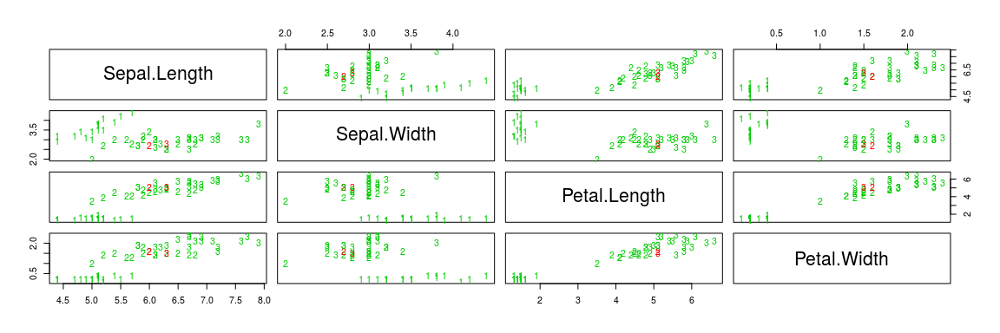

Classification selon les plus proches voisins
================
Antoine Chambaz
25/9/2017

Les notions
-----------

-   Algorithmes de classification selon les *k* plus proches voisins et selon les voisins pondérés

-   Ensembles d'apprentissage et de test

-   Interprétation algorithmique de l'entreprise de classification

-   Reproductibilité

-   Validation croisée pour l'évaluation honnête et la comparaison des performances

-   Visualisation d'un classifieur et de ses performances

Une introduction à la classification selon les plus proches voisins
-------------------------------------------------------------------

``` r
set.seed(54321)
```

-   Préparatifs:

``` r
suppressMessages(library(caret))
data(iris)
head(iris)
```

    ##   Sepal.Length Sepal.Width Petal.Length Petal.Width Species
    ## 1          5.1         3.5          1.4         0.2  setosa
    ## 2          4.9         3.0          1.4         0.2  setosa
    ## 3          4.7         3.2          1.3         0.2  setosa
    ## 4          4.6         3.1          1.5         0.2  setosa
    ## 5          5.0         3.6          1.4         0.2  setosa
    ## 6          5.4         3.9          1.7         0.4  setosa

``` r
species.col <- grep("Species", colnames(iris))
m <- nrow(iris)
val <- sample(1:m, size = round(m/3), replace = FALSE, prob = rep(1/m, m)) 
iris.train <- iris[-val, ]
iris.test <- iris[val, ]
```

-   Pour obtenir une description du jeu de données, exécuter `?iris`.

``` r
nb.neighbors <- 4
trained.knn <- knn3(Species ~ ., iris.train, k = nb.neighbors)
test.probs.knn <- predict(trained.knn, iris.test)
test.preds.knn <- colnames(test.probs.knn)[apply(test.probs.knn, 1, which.max)]
perf.knn <- table(test.preds.knn, iris.test[, species.col], dnn = list("pred", "truth"))
perf.knn
```

    ##             truth
    ## pred         setosa versicolor virginica
    ##   setosa         16          0         0
    ##   versicolor      0         13         1
    ##   virginica       0          1        19

-   Pour obtenir une description de la fonction `knn3`, exécuter `?knn3` (généralisation évidente).

``` r
suppressMessages(library(kknn))
## issu de l'aide de la fonction 'kknn'
trained.kknn <- kknn(Species~., iris.train, iris.test, distance = 1,
    kernel = "triangular")
```

-   Pour accéder à un résumé de l'objet `trained.knn`, exécuter `summary(trained.kknn)`.

``` r
test.preds.kknn <- fitted(trained.kknn)
perf.kknn <- table(iris.test$Species, test.preds.kknn, dnn = list("pred", "truth"))
perf.kknn
```

    ##             truth
    ## pred         setosa versicolor virginica
    ##   setosa         16          0         0
    ##   versicolor      0         11         3
    ##   virginica       0          1        19

-   Visualisation des résultats.

``` r
pcol <- as.character(as.numeric(iris.test$Species))
## knn3
pairs(iris.test[1:4], pch = pcol, col = c("green3", "red")
[(iris.test$Species != test.preds.kknn)+1])
```


``` r
## kknn
pairs(iris.test[1:4], pch = pcol, col = c("green3", "red")
[(iris.test$Species != test.preds.knn)+1])
```



-   Sélection d'un nombre de voisins optimal par validation croisée.

``` r
library(e1071)
tune.knn(iris.train[, -species.col], iris.train[, species.col], k = 1:20)
```

    ## 
    ## Parameter tuning of 'knn.wrapper':
    ## 
    ## - sampling method: 10-fold cross validation 
    ## 
    ## - best parameters:
    ##  k
    ##  1
    ## 
    ## - best performance: 0.01

Sur suggestion de la classe (2017-2018)…
----------------------------------------

-   Il arrive qu'un classifieur selon les plus proches voisins hésite entre deux classes (ou plus) – cela survient lorsque les probabilités conditionnelles estimées d'appartenir à deux classes (ou plus) sont égales et maximales. Inspiré très largement de l'algorithme `knn3`, le méta-algorithme `knn4` codé et utilisé ci-dessous a pour objectif de réduire le nombre d'occurrences de telles hésitations.

``` r
knn4 <- function(formula, data, kk = 2:5){
  ##
  ## see 'getAnywhere(knn3.formula)'
  ##
  if (length(kk) == 1) {
    out <- knn3(formula, data, k = kk)
  } else {
    FUN <- function(xx, ...){
      knn3(k = xx, ...)
    }
    out <- lapply(kk, FUN, formula, data)
  }
  class(out) <- "knn4"
  return(out)
}

predict.knn4 <- function(object, newdata) {
  FUN <- function (ii, xx){
    ## tests if the argmax is uniquely achieved
    m <- max(xx[ii, ])
    w <- which(xx[ii, ] == m)
    length(w) == 1
  }
  kk <- 1
  pred <- predict(object[[kk]], newdata)
  nk <- length(object)
  if (nk > 1) {
    done <- sapply(1:nrow(pred), FUN, pred)
    if (any(!done) && (kk < nk)) {
      kk <- kk + 1
      newpred <- predict(object[[kk]], newdata[!done, ])
      keep <- sapply(1:nrow(newpred), FUN, newpred)
      if (any(keep)) {
        if (sum(!done) == 1) {
          pred[!done] <- newpred[keep]
        } else {
          pred[!done, ][keep, ] <- newpred[keep, ]
        }
      }
      done[!done][keep] <- TRUE
    }
    if (any(!done)) {
      pred[!done, ] <- newpred[!keep]
    }
  }
  return(pred)
}

trained.knn4 <- knn4(Species ~ ., iris.train, kk = c(3, 6, 9))
test.probs.knn4 <- predict(trained.knn4, iris.test)
test.preds.knn4 <- colnames(test.probs.knn4)[apply(test.probs.knn4, 1, which.max)]
perf.knn4 <- table(test.preds.knn4, iris.test[, species.col], dnn = list("pred", "truth"))
perf.knn4
```

    ##             truth
    ## pred         setosa versicolor virginica
    ##   setosa         16          0         0
    ##   versicolor      0         11         0
    ##   virginica       0          3        20

[Retour à la table des matières](https://github.com/achambaz/laviemodedemploi#liens)
