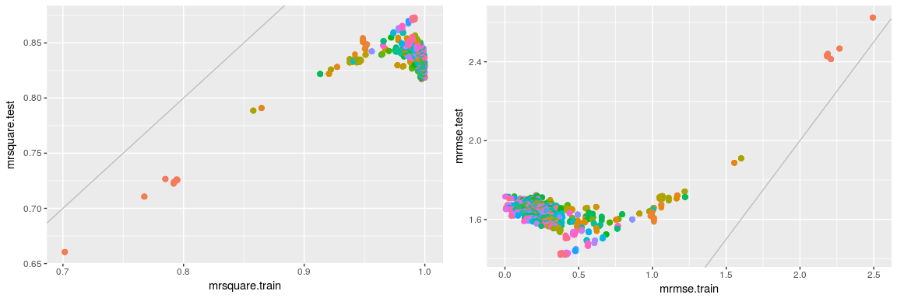

Régression par «exteme gradient boosting»
================
Antoine Chambaz
23/10/2017

Les notions
-----------

-   Algorithme de régression par «extreme gradient boosting».

-   Ensembles d'apprentissage et de validation

-   «Machine-learning pipelines»

-   Principe de validation croisée

-   Reproductibilité

Fichier source
--------------

Afin d'extraire les portions de code `R` du fichier source [`regression.xgboost.Rmd`](https://github.com/achambaz/laviemodedemploi/blob/master/regression.xgboost/regression.xgboost.Rmd), il suffit d'exécuter dans `R` la commande `knitr::purl("regression.xgboost.Rmd")`.

Préparation de la session `R`
-----------------------------

``` r
pkgs <- c("xgboost", "tidyverse", "devtools")
for (pkg in pkgs) {
  if (! (pkg %in% rownames(installed.packages()))) {
    install.packages(pkg)
  }
}
pkg <- "pipelearner"
if (! (pkg %in% rownames(installed.packages()))) {
  devtools::install_github("drsimonj/pipelearner")
}
```

``` r
suppressMessages(library(tidyverse))
suppressMessages(library(lazyeval))
```

Une introduction à la régression par «extreme gradient boosting»
----------------------------------------------------------------

``` r
set.seed(54321)
```

-   Mises à disposition par Météo France, ces données sont extraites du site [wikistat](https://github.com/wikistat). Nous souhaitons apprendre à prédire, à partir des données du jour, la concentration dioxyde d'azote le lendemain.

``` r
one_hot <- function(df) {
  as_tibble(stats::model.matrix(~.+0, data = df))
}

file <- file.path("http://www.math.univ-toulouse.fr/~besse/Wikistat/data", "depSeuil.dat")
ozone <- read_csv(file, col_names = TRUE) %>% one_hot %>% mutate_all(as.numeric)
```

    ## Parsed with column specification:
    ## cols(
    ##   JOUR = col_integer(),
    ##   O3obs = col_integer(),
    ##   MOCAGE = col_double(),
    ##   TEMPE = col_double(),
    ##   RMH2O = col_double(),
    ##   NO2 = col_double(),
    ##   NO = col_double(),
    ##   STATION = col_character(),
    ##   VentMOD = col_double(),
    ##   VentANG = col_double()
    ## )

``` r
## JOUR: jour férié (1) ou pas (0)
## O3obs: concentration d'ozone effectivement observée le lendemain à 17h locales (correspond souvent au maximum de pollution observée)
## MOCAGE: prévision de cette pollution obtenue par un modèle déterministe de mécanique des fluides
## TEMPE: température prévue par Météo France pour le lendemain 17h
## RMH2O: rapport d'humidité
## NO2: concentration en dioxyde d'azote
## NO: concentration en monoxyde d'azote
## STATION: lieu de l'observation (Aix-en-Provence, Rambouillet, Munchhausen, Cadarache et Plan de Cuques)
## VentMOD: force du vent
## VentANG: orientation du vent

head(ozone)
```

    ## # A tibble: 6 x 14
    ##    JOUR O3obs MOCAGE TEMPE   RMH2O   NO2    NO STATIONAix STATIONAls
    ##   <dbl> <dbl>  <dbl> <dbl>   <dbl> <dbl> <dbl>      <dbl>      <dbl>
    ## 1     1    91   93.2  21.5 0.00847 1.602 0.424          1          0
    ## 2     1   100  104.6  20.2 0.00881 2.121 0.531          1          0
    ## 3     0    82  103.6  17.4 0.00951 1.657 0.467          1          0
    ## 4     0    94   94.8  18.8 0.00855 2.350 0.701          1          0
    ## 5     0   107   99.0  23.7 0.00731 1.653 0.452          1          0
    ## 6     0   150  114.3  23.6 0.01182 5.316 1.343          1          0
    ## # ... with 5 more variables: STATIONCad <dbl>, STATIONPla <dbl>,
    ## #   STATIONRam <dbl>, VentMOD <dbl>, VentANG <dbl>

<!-- [lien intéressant](http://www.win-vector.com/blog/2017/04/encoding-categorical-variables-one-hot-and-beyond/)-->
A quoi la fonction `one_hot` sert-elle? Noter que nous avons dû transformer toutes les informations au format `numeric`.

*Remarque.* La variable `STATION` se prêterait volontiers à un recodage plus riche…

-   Préparation d'un ensemble d'apprentissage et d'un ensemble de validation.

``` r
m <- nrow(ozone)
val <- sample(1:m, size = round(m/3), replace = FALSE, prob = rep(1/m, m)) 
ozone.train <- ozone[-val, ]
ozone.test <- ozone[val, ]
```

-   Régression `xgboost`

Le nom `xgboost` est inspiré de l'expression «extreme gradient boosting» Cet algorithme d'apprentissage est aujourd'hui très apprécié dans la communauté du «machine learning». Vous trouverez une brève introduction aux principes sur lesquels cet algorithme est fondé [ici](http://xgboost.readthedocs.io/en/latest/model.html).

Sans finasser…

``` r
suppressMessages(library(xgboost))

get.rmse <- function(fit, newdata, target_var) {
  ## Convert 'newdata' object to data.frame
  newdata <- as.data.frame(newdata)
  ## Get feature matrix and labels
  X <- newdata %>%
    select(-matches(target_var)) %>% 
    as.matrix()
  Y <- newdata[[target_var]]
  ## Compute and return 'rmse'
  sqrt( mean((Y - predict(fit, X))^2) )
}


ozone.train.X <- select(ozone.train, -NO2) %>% as.matrix
ozone.train.Y <- ozone.train$NO2

nrounds <- 50
fit.xgboost.one <- xgboost(data = ozone.train.X, label = ozone.train.Y,
                           nrounds = nrounds, objective = "reg:linear", print_every = 10)
```

    ## [1]  train-rmse:3.794720 
    ## [11] train-rmse:0.433916 
    ## [21] train-rmse:0.184687 
    ## [31] train-rmse:0.137011 
    ## [41] train-rmse:0.101266 
    ## [50] train-rmse:0.067837

``` r
rmse.test.one <- get.rmse(fit.xgboost.one, ozone.test, "NO2")
rmse.test.one
```

    ## [1] 0.9830637

Aurions-nous gagné à jouer sur les paramètres? Ici, nous passons la variable `eta` de sa valeur par défaut, `0.3`, à `0.1`.

``` r
params <- list(booster = "gbtree", objective = "reg:linear", eta = 0.1, gamma = 0,
               max_depth = 6, min_child_weight = 1, subsample = 1, colsample_bytree = 1)

fit.xgboost.two <- xgboost(data = ozone.train.X, label = ozone.train.Y,
                           nrounds = nrounds, params = params, print_every = 10)
```

    ## [1]  train-rmse:4.659818 
    ## [11] train-rmse:2.007874 
    ## [21] train-rmse:0.980167 
    ## [31] train-rmse:0.539510 
    ## [41] train-rmse:0.332184 
    ## [50] train-rmse:0.241041

``` r
rmse.test.two <- get.rmse(fit.xgboost.two, ozone.test, "NO2")
rmse.test.two
```

    ## [1] 1.045572

Ou bien, aurions-nous gagné à stopper les itérations plus tôt?

``` r
params <- list(booster = "gbtree", objective = "reg:linear", eta = 0.3, gamma = 0,
               max_depth = 6, min_child_weight = 1, subsample = 1, colsample_bytree = 1)

fit.xgboost.cv <- xgb.cv(data = ozone.train.X, label = ozone.train.Y,
                         nrounds = nrounds, nfold = 5, params = params, print_every = 10,
                         showsd = TRUE, early.stopping.rounds = 20, maximize = FALSE)
```

    ## [1]  train-rmse:3.797699+0.121068    test-rmse:3.815394+0.639161 
    ## [11] train-rmse:0.426928+0.044636    test-rmse:1.609930+0.561910 
    ## [21] train-rmse:0.164069+0.011360    test-rmse:1.637574+0.564669 
    ## [31] train-rmse:0.107791+0.011961    test-rmse:1.644937+0.576037 
    ## [41] train-rmse:0.074014+0.010449    test-rmse:1.645869+0.575922 
    ## [50] train-rmse:0.052082+0.008001    test-rmse:1.644881+0.576451

``` r
best.xgboost.count <- which.min(fit.xgboost.cv$evaluation_log$test_rmse_mean)
fit.xgboost.three <- xgboost(data = ozone.train.X, label = ozone.train.Y,
                             nrounds = best.xgboost.count, params = params, print_every = 10)
```

    ## [1]  train-rmse:3.794720 
    ## [11] train-rmse:0.433916

``` r
rmse.test.three <- get.rmse(fit.xgboost.three, ozone.test, "NO2")
best.xgboost.count
```

    ## [1] 11

``` r
rmse.test.three
```

    ## [1] 1.004428

Mise en place d'une «ML pipeline»
---------------------------------

Cette section s'inspire de [ce billet](https://drsimonj.svbtle.com/with-our-powers-combined-xgboost-and-pipelearner), & il faudrait trouver une jolie expression française.

Nous commençons par définir les fonctions `r.square` (inspirée de `modelr::rsquare`, mais capable de s'adapter à la présence de nouvelles données) et `pl.xgboost` (une version de `xgboost` se prêtant au «ML pipelining»).

``` r
get.params <- function(ll) {
  sprintf("nrounds=%i,eta=%.1f,gamma=%.1f,max_depth=%i", ll$nrounds, ll$eta, ll$gamma, ll$max_depth)
}
get.rsquare <- function(fit, newdata, target_var) {
  ## Convert 'newdata' object to data.frame
  newdata <- as.data.frame(newdata)
  ## Get feature matrix and labels
  actual <- newdata[[target_var]]
  X <- newdata %>%
    select(-matches(target_var)) %>% 
    as.matrix()
  residuals <- predict(fit, X) - actual
  ## Compute and return 'rsquare'
  1 - (var(residuals, na.rm = TRUE) / var(actual, na.rm = TRUE))
}
pl.xgboost <- function(data, formula, ...) {
  data <- as.data.frame(data)

  X_names <- as.character(f_rhs(formula))
  y_name  <- as.character(f_lhs(formula))

  if (X_names == '.') {
    X_names <- names(data)[names(data) != y_name]
  }

  X <- data.matrix(data[, X_names])
  y <- data[[y_name]]

  xgboost(data = X, label = y, ...)
}
```

-   Nous voilà enfin prêts à procéder à l'évaluation d'une variété de paramétrisations de `xgboost` par «ML pipelining»

``` r
suppressMessages(library(pipelearner))

pl <- pipelearner(ozone.train, pl.xgboost, NO2 ~ .,
                  nrounds = seq(10, 60, 10),
                  eta = seq(0.1, 0.5, 0.1),
                  gamma = seq(0.0, 0.5, 0.1),
                  max_depth = seq.int(2, 7, 1),
                  verbose = 0) %>%
  learn_cvpairs(crossv_kfold, k = 5)
```

    ## Warning: `cross_d()` is deprecated; please use `cross_df()` instead.

    ## Warning: `cross_d()` is deprecated; please use `cross_df()` instead.

``` r
fits.xgboost <- pl %>% learn()

results.xgboost <- fits.xgboost %>% 
  mutate(
    ## Get hyperparameters
    # nrounds = map_dbl(params, "nrounds"),
    # eta = map_dbl(params, "eta"),
    # gamma = map_dbl(params, "gamma"),
    # max_depth = map_dbl(params, "max_depth"),
    negm = map_chr(params, get.params),
    ## Get rmse
    rmse.train = pmap_dbl(list(fit, train, target), get.rmse),
    rmse.test  = pmap_dbl(list(fit, test,  target), get.rmse),
    ## Get r-square
    rsquare.train = pmap_dbl(list(fit, train, target), get.rsquare),
    rsquare.test  = pmap_dbl(list(fit, test, target), get.rsquare)
  ) %>%
  group_by(negm) %>%
  summarise(
    mrmse.train = mean(rmse.train),
    mrmse.test = mean(rmse.test),
    mrsquare.train = mean(rsquare.train),
    mrsquare.test = mean(rsquare.test),    
  ) %>%
  ## Order rows
  arrange(desc(mrmse.test))

tail(results.xgboost)
```

    ## # A tibble: 6 x 5
    ##                                       negm mrmse.train mrmse.test
    ##                                      <chr>       <dbl>      <dbl>
    ## 1 nrounds=50,eta=0.5,gamma=0.4,max_depth=2   0.4281491   1.428653
    ## 2 nrounds=60,eta=0.5,gamma=0.1,max_depth=2   0.3763972   1.424863
    ## 3 nrounds=60,eta=0.5,gamma=0.3,max_depth=2   0.3783537   1.424098
    ## 4 nrounds=50,eta=0.5,gamma=0.2,max_depth=2   0.4211058   1.422060
    ## 5 nrounds=60,eta=0.5,gamma=0.5,max_depth=2   0.4047537   1.420162
    ## 6 nrounds=60,eta=0.5,gamma=0.2,max_depth=2   0.3763394   1.420089
    ## # ... with 2 more variables: mrsquare.train <dbl>, mrsquare.test <dbl>

-   Pour conclure, visualisons les différentes mesures de perfomance. En abscisse, celles obtenues sur l'ensemble d'apprentissage; en ordonnée, celles obtenues sur l'ensemble de validation (ordonnée), au sein de la procédure de validation croisée — seules ces dernières sont pertinentes.

``` r
fig.one <- results.xgboost %>%
  ggplot(aes(mrsquare.train, mrsquare.test, color = negm)) +
  guides(color = FALSE) +
  geom_point(size = 2) +
  geom_abline(intercept = 0, slope = 1, color = "grey")

fig.two <- results.xgboost %>%
  ggplot(aes(mrmse.train, mrmse.test, color = negm)) +
  guides(color = FALSE) +
  geom_point(size = 2) +
  geom_abline(intercept = 0, slope = 1, color = "grey")

multiplot(fig.one, fig.two, cols = 2)
```



D'après le résultat de la commande \``tail(results.xgboost)`, le meilleur paramétrage parmi ceux essayés (identifié selon le risque quadratique validé croisé) correspond à nrounds=60,eta=0.5,gamma=0.2,max\_depth=2. En conclusion:

``` r
eval(parse(text = paste("params <- list(
booster = \"gbtree\", objective = \"reg:linear\",
min_child_weight = 1, subsample = 1, colsample_bytree = 1,",
tail(results.xgboost, 1)$negm,
")")))

fit.xgboost.best <- xgboost(data = ozone.train.X, label = ozone.train.Y,
                            nrounds = nrounds, params = params, print_every = 10)
```

    ## [1]  train-rmse:3.138997 
    ## [11] train-rmse:0.968067 
    ## [21] train-rmse:0.696707 
    ## [31] train-rmse:0.588219 
    ## [41] train-rmse:0.507341 
    ## [50] train-rmse:0.474183

``` r
rmse.test.best <- get.rmse(fit.xgboost.best, ozone.test, "NO2")
rmse.test.best
```

    ## [1] 0.929618

[Retour à la table des matières](https://github.com/achambaz/laviemodedemploi#liens)
